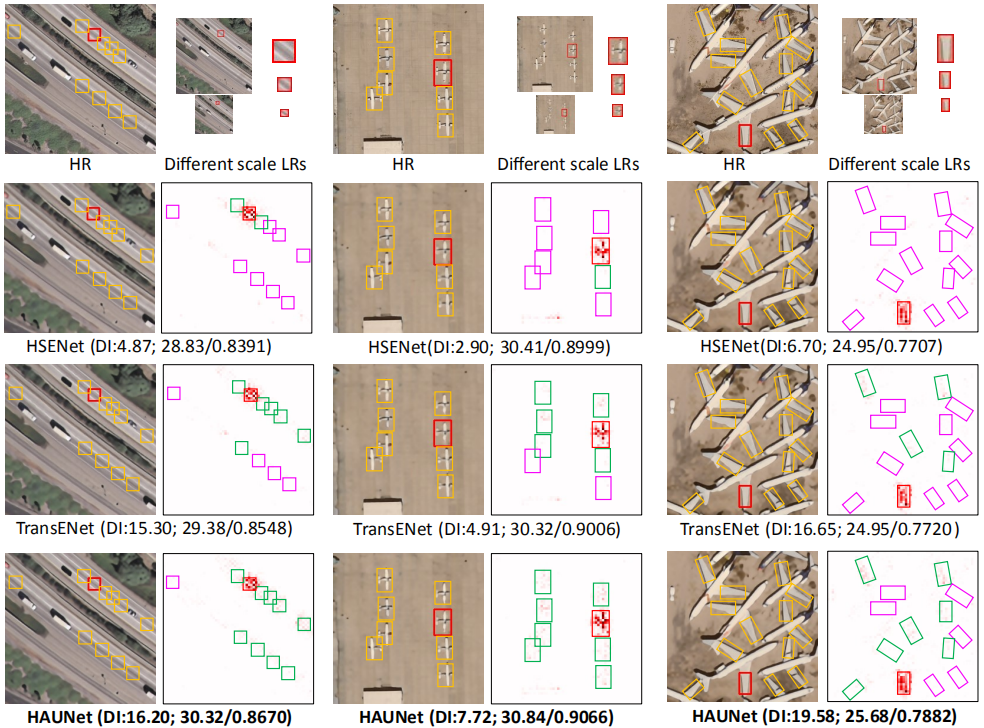

# Hybrid Attention Based U-shaped Network for Remote Sensing Image Super-Resolution
Official Pytorch implementation of the paper "Hybrid Attention Based U-shaped Network for Remote Sensing Image Super-Resolution"(Accept by TGRS).  
Jiarui Wang, Binglu Wang*, Xiaoxu Wang, Yongqiang Zhao, and Teng Long

[](https://ieeexplore.ieee.org/document/10145829)

## Abstract
Recently, remote sensing image super-resolution (RSISR) has drawn considerable attention and made great breakthroughs based on convolutional neural networks (CNNs). Due to the scale and richness of texture and structural information frequently recurring inside the same remote sensing images (RSIs) but varying greatly with different RSIs, state-of-the-art CNN-based methods have begun to explore the multi-scale global features in RSIs by using attention mechanisms. However, they are still insufficient to explore significant content attention clues in RSIs. In this paper, we present a new Hybrid Attention-based U-shaped Network (HAUNet) for RSISR to effectively explore the multi-scale features and enhance the global feature representation by hybrid convolution-based attention. It contains two kinds of convolutional attention-based Single-scale feature Extraction Modules (SEM) to explore the global spatial context information and abstract content information, and a Cross-scale Interaction Module (CIM) as the skip connection between different scale feature outputs of encoders to bridge the semantic and resolution gaps between them. Considering the existence of equipment with poor hardware facilities, we further design a lighter HAUNet-S with about 596K parameters. Experimental attribution analysis method LAM results demonstrate that our HAUNet is a more efficient way to capture meaningful content information and quantitative results can show that our HAUNet can significantly improve the performance of RSISR on four remote sensing test datasets. Meanwhile, HAUNET-S also maintains competitive performance.
## LAM result

## Requirements
- Python 3.6+
- Pytorch>=1.6
- torchvision>=0.7.0
- einops
- matplotlib
- cv2
- scipy
- tqdm
- scikit
- sewar


## Installation
Clone or download this code and install aforementioned requirements 
```
cd codes
```

## Train
Download the UCMerced dataset[[Baidu Drive](https://pan.baidu.com/s/1ijFUcLozP2wiHg14VBFYWw),password:terr][[Google Drive](https://drive.google.com/file/d/12pmtffUEAhbEAIn_pit8FxwcdNk4Bgjg/view)], 
RSCNN7 dataset[[Baidu Drive](https://pan.baidu.com/s/1EOfIRw4lbdQ164hYFwyzLw), password: piyq]
[[Google Drive](https://drive.google.com/file/d/13uBNvbbPjzxqcfBRf1bySjGrZZJC2W9M/view?usp=sharing)],
WHU-RS19 dataset[[Baidu Drive](https://pan.baidu.com/s/1hGMCXBxi9AVx4sacB06KQQ),password:ol6j]
[[Google Drive](https://drive.google.com/file/d/1BMKpeCuLqFLGCiaZoCxY7lECWV_diNk2/view?usp=sharing)], 
and AID dataset[[Baidu Drive](https://pan.baidu.com/s/1Cf-J_YdcCB2avPEUZNBoCA),password:id1n]
[[Google Drive](https://drive.google.com/file/d/1d_Wq_U8DW-dOC3etvF4bbbWMOEqtZwF7/view)].
The first three datasets are for training and testing which have been split them into train/val/test data, and the last dataset is used as as a supplement to the AID test set to better evaluate the SR performance and generalization ability. In every dataset, the original images would be taken as the HR references and the corresponding LR images are generated by bicubic down-sample. 
```
# x4
python demo_train.py --model=HAUNET --dataset=UCMerced --scale=4 --patch_size=192 --ext=img --save=HAUNETx4_UCMerced
# x3
python demo_train.py --model=HAUNET --dataset=UCMerced --scale=3 --patch_size=144 --ext=img --save=HAUNETx3_UCMerced
# x2
python demo_train.py --model=HAUNET --dataset=UCMerced --scale=2 --patch_size=96 --ext=img --save=HAUNETx2_UCMerced
```
Download the trained model in this paper [[Baidu Drive](https://pan.baidu.com/s/1LPT4Kc2YVzjFG6Q85XMawg), password:qfd7], [[Google Drive](https://drive.google.com/drive/folders/1A8Kssv1qUbSWOqG-5X_zOGhmXgu0RRsX?usp=sharing)].

The train/val data pathes are set in [data/__init__.py](codes/data/__init__.py) 

## Test 
The test data path and the save path can be edited in [demo_deploy.py](codes/demo_deploy.py)

```
# x4
python demo_deploy.py --model=HAUNET --scale=4 --patch_size=256 --test_block=True
# x3
python demo_deploy.py --model=HAUNET --scale=3 --patch_size=192 --test_block=True
# x2
python demo_deploy.py --model=HAUNET --scale=2 --patch_size=128 --test_block=True
```

## Evaluation 
Compute the evaluated results in term of PSNR, SSIM, SAM, QI, and SCC, where the SR/HR paths can be edited in [calculate_metric.py](codes/metric_scripts/calculate_metric.py)

```
cd metric_scripts 
python calculate_metric.py
```


## Acknowledgements 
This code is built on [HSENET (Pytorch)](https://github.com/Shaosifan/HSENet) and [TRANSENET (Pytorch)](https://github.com/Shaosifan/TransENet). 
The LAM results in this paper is tested on [LAM_DEMO (Pytorch)](https://github.com/X-Lowlevel-Vision/LAM_Demo). 
We thank the authors for sharing the codes.  


